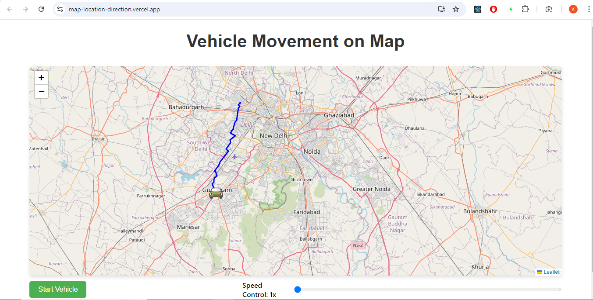

# Vehicle Movement on Map

This project is a React-based web application that simulates real-time vehicle movement along a route on a map. The application demonstrates a vehicle moving from Gurgaon to Delhi, with speed controls and a start button to control the movement. It uses **Leaflet.js** for map rendering and **OpenRouteService API** for fetching the route.

## Features

- **Real-Time Vehicle Movement**: The vehicle moves along a predefined route between two points.
- **Speed Control**: The speed of the vehicle can be adjusted via a slider.
- **Start Button**: A button to start the movement of the vehicle.
- **Responsive Design**: The app's layout adjusts to fit the screen, ensuring all components are visible without scrolling.

## Technologies Used

- **React**: JavaScript library for building user interfaces.
- **Leaflet.js**: A library for interactive maps.
- **OpenRouteService API**: A service for fetching routing data.
- **Axios**: For making HTTP requests to the OpenRouteService API.
- **CSS**: Styling the application components.

## Installation and Setup

1. Clone the repository:
   ```bash
   git clone <your-repository-link>
2. Navigate to the project directory:
    ```bash
    cd vehicle-movement-map
3. Install dependencies:
    ```bash
    npm install
4. Create a .env file in the project root directory and add your OpenRouteService API key:
    ```bash
    REACT_APP_OPENROUTESERVICE_API_KEY=your-api-key-here
5. Start the development server:
    ```bash
    npm start
6. Open the app in your browser:
    http://localhost:3000

## How to Use

1. The map will load with the initial vehicle position in Gurgaon.
2. Click on the Start Vehicle button to begin the vehicle movement along the route to Delhi.
3. Use the Speed Control slider to adjust the speed of the vehicle.
4. Watch the vehicle move along the route in real-time.

## Screenshot



## File Structure

- src/components/MapComponent.js: The core component for rendering the map, fetching the route, and managing the vehicle's movement.
- src/App.js: The main application file that includes the map component.
- src/App.css: The main stylesheet for the app layout.
- src/components/MapComponent.css: Styles specific to the map and control elements.

## API Used

**OpenRouteService API**: The API provides route data for driving, cycling, and walking. In this project, it fetches the driving route between Gurgaon and Delhi. You need an API key from OpenRouteService to use it.

## Future Improvements

- Add more customization for vehicle icons and routes.
- Provide an option to pause/resume the vehicle movement.
- Implement user-defined routes between different locations.

## Contributing

Feel free to fork this project, submit issues, or make pull requests for new features or bug fixes.

## License
This project is open-source under the MIT License.
